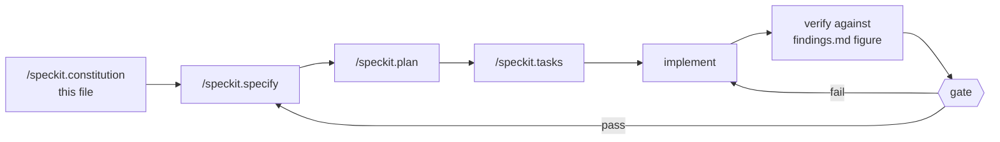

<!--
Sync Impact Report
==================
Version change: 1.0.0 → 1.1.0

MINOR: added Principle XI (Portable By Construction) — no hardcoded
client, instrument, sector, date or market series in `pipeline/`; no
file-upload feature; scenario parameters passed in. Added to Principle X
an explicit prohibition on the phrase "production ready" and the correct
substitute formulation. Principles XI–XIV renumbered to XII–XV.

--- prior report ---
Version change: (new) → 1.0.0

Initial ratification. Inherits the portable governance core used on
Bantáy, ALJ, idphoto-vton-poc, Antabay and Rewind — specification first,
requirement traceability, evidence over assertion, scope discipline,
living documentation — and states explicitly which parts are suspended
for a ten-hour build and why.

Deliberate deviations from the standing team baseline, each named in
place rather than left implicit:

- VIII. Evidence-Based Test Pyramid — the standing 70/20/10
  unit/integration/e2e split is retained in SHAPE but restated in
  absolute counts (approx. 14/4/2), because a percentage target on a
  ten-hour build produces either theatre or an excuse. Integration is
  redefined: there are no external services at demo time, so the
  integration layer tests detectors against real rows from `data/`.
- IX. Gate Authority — solo build, so gates are self-attested and
  recorded as git tags with a time. The recording is the control, not
  the second signature.
- Technology Standards — no license-lineage standard is needed here
  (no model weights are redistributed); the equivalent risk on this
  project is unsourced numbers, governed by Principle V.

Open clarifications: NONE. Every figure this project asserts has been
computed from `data/` and recorded in `.alamazing/findings.md`. Every
scope question is closed in Principle XIII.

Templates requiring updates:
- ✅ alamazing-all-specs.md — block 1 carries this file verbatim
- ✅ RUN-SHEET.md — gates and checkpoints match Articles XIII and XIV
-->

# Constitution — alamazing-singhacks-2026

**Official title: ALAMazing — Divergence Engine.** This file keeps the
repo name as its identifier; the title above is the display name used in
the README and the pitch.

**Scope:** One project, one build. SingHacks 2026, Julius Baer Wealth
Intelligence challenge. Solo. **Submission 18:00 SGT Saturday 5 September.
Feature freeze 16:00.**

> Paste this entire file into `/speckit.constitution` before the first
> `/speckit.specify`. Everything specified afterwards inherits it.

---

## Preamble

This is a hackathon constitution, not a product one. It inherits the
governance core used across this team's spec-driven work and deliberately
suspends the parts that only pay off over months. Where the standing
methodology and the clock conflict, this document says which wins, so
nothing is relitigated at 15:00 under pressure.

The failure mode being governed against is not bad code. It is **twenty
clients summarised competently and nothing anyone remembers at 18:10.**

Julius Baer stated the standard themselves: a team that says *"this
client's bond portfolio is down USD 5.6m"* has done arithmetic. A team
that explains who he is, what he told his relationship manager, and why
waiting is not a plan he can outlive has understood the client. **The
second wins even when the first number is more precise.**

---

## Core Principles

### I. Demo Primacy

The deliverable is a **three-minute demonstration**, not a repository.
Every task MUST be judged by one question: does this change what the
judges see? Work that does not reach the screen is out of scope, however
correct it is.

The demo script is written **before** the code — `.alamazing/demo-script.md`
— and the client brief screen (S2) MUST be built before any other screen.

**Rationale**: Two of the four judging criteria (User Experience and
Design, and the presentation component of Strategic Impact) are assessed
entirely from what appears on screen in three minutes. A correct pipeline
with no rendered brief scores zero on half the rubric.

### II. Specification First, Time-Boxed

No implementation before the specification is written. All eight specs
are drafted in `alamazing-all-specs.md`. **Editing a spec mid-build is capped at ten
minutes.** An unfinished edit at the cap MUST be closed with an explicit
recorded assumption rather than extended.

Specifications state **what and why**. Column names, function signatures
and library choices belong in `.alamazing/implementation.md`.

**Rationale**: The cap is the rule, not a suggestion. Spec drift under
time pressure is how a solo build arrives at 16:00 with three
half-implemented interpretations of the same feature.

### III. The Spine Rule

The single riskiest assumption MUST be proven with the ugliest possible
script **before any feature work begins**. No UI, no abstraction, no error
handling.

The spine for this project is one number: **the pipeline produces
42.134 (± 0.001) for CL-0019 from the raw files.** That is the look-through
concentration on which the entire product rests. Six lines of pandas
prove it.

If the spine does not hold, no downstream work is authorised until it
does.

**Rationale**: Every finding, every screen and every sentence of the
pitch assumes that number is reachable. Discovering at 13:00 that it is
not is unrecoverable; discovering it at step 9 of setup costs ten minutes.

### IV. Nothing Is Invented

Portfolio facts MUST come from the twelve files in `data/` or they do not
exist. No external market data, no model recollection, no plausible
inference presented as fact.

`event_log.csv` is **authoritative** for anything that occurred in 2026.
Where the model's recollection and the file disagree, the file wins.
Explanations MUST cite events by their date and description from the file
only.

**Rationale**: Julius Baer wrote the reason into the brief — *a real
advisory system cannot let a language model free-associate about
geopolitics in front of a client.* Grounding in a controlled, auditable
event source is the difference between an explanation defensible in a
compliance review and one that merely sounds plausible. The judges
authored this dataset and will recognise an invented event immediately.

### V. The Model Reads and Writes. It Never Counts.

| The model MUST | The model MUST NOT |
|---|---|
| Read prose — stated objectives, RM notes | Perform arithmetic of any kind |
| Convert a stated wish into a testable claim | Decide whether a claim is violated |
| Weigh which finding matters for this person | Compute a weight, total or delta |
| Write three paragraphs and one opening line | Receive a raw client record |

Every figure in every output MUST be computed by deterministic Python.
The model receives derived findings only.

**Rationale**: This is the architectural spine and the answer to half the
questions a banking judge will ask. It keeps the numbers reproducible,
keeps client data out of the model's context, and gives a regulator asking
*"why did your system say this on 26 August"* the same answer twice. It is
also what makes the product honest — the AI is doing the thing only an AI
can do (reading prose), and nothing else.

### VI. Evidence Over Assertion

Every finding MUST carry its sources: file, row identifiers, values, and
any `event_log` entries relied upon.

**A detector that cannot produce evidence MUST produce nothing.** There is
no such thing as an unsourced finding. Correct logic with missing evidence
is a defect, not a feature.

The evidence panel MUST be visible without interaction on desktop.

**Rationale**: Traceability is the whole difference between this and a
plausible-sounding chatbot, and it is most of the Technical and
Operational Feasibility criterion. A verdict shown without the evidence
behind it is exactly what the brief warns against as confident
fabrication.

### VII. Determinism

Identical inputs MUST produce identical output. Always.

Briefs are generated at **build time** and committed to `findings.json`.
No model call occurs at demo time. Model temperature MUST be 0 and the
prompt MUST be committed alongside its output.

**Rationale**: A regulated advisory system cannot answer differently on
different days. It is also why the demo cannot fail on stage — the same
reason Antabay locked SEL→TYO and Rewind pre-warmed its sandboxes. There
is nothing running to fail.

### VIII. Evidence-Based Test Pyramid

The standing team split is 70/20/10 unit/integration/e2e. That shape is
retained; the volume is compressed and stated in **absolute counts**,
because a percentage target on a ten-hour build produces either theatre
or an excuse.

| Layer | What it covers | Count | When |
|---|---|---|---|
| **Unit (~70%)** | Pure logic with no file or model access: `underlying_reference` parsing, client-level weight recomputation, band comparison, breach classification, liquidity tiering, scenario repricing | ~14 assertions, sub-second | Alongside each detector |
| **Integration (~20%)** | Each detector against **real rows from `data/`**, asserted to the figure recorded in `.alamazing/findings.md` | ~4 tests | At the end of each of specs 001–005 |
| **E2E (~10%)** | `build.py` end to end, twice, asserting identical output; plus the rendered brief containing the expected figure | 2 tests | At G3, re-run before freeze |

**The integration layer is redefined for this project.** There are no
external services at demo time, so "integration" does not mean contract
tests against a vendor. It means the detector runs against the actual
Julius Baer files and produces the actual number.

**Every integration assertion MUST cite a figure from
`.alamazing/findings.md`**, which records how each was computed. A test
asserting a number with no recorded derivation is not evidence-based and
does not count toward this article.

Required assertions, non-negotiable:

| Test | Asserts |
|---|---|
| `test_lookthrough_cl0019` | 42.134 ± 0.001 |
| `test_lookthrough_cl0014` | 29.46 ± 0.01 (Golden Harbour across three asset classes) |
| `test_mandate_cl0003_inherited` | Equity 71.46 vs 10–30, classification `inherited` |
| `test_mandate_cl0019_clean` | No breach; `compliance_clean` is True |
| `test_scenario_cl0019` | −2.5m ± 0.1m, −7.8% ± 0.2 |
| `test_findings_are_deterministic` | Two builds, identical output |

**What is NOT tested**: UI rendering, error paths outside the demo script,
model output quality, and anything already declared out of scope. A test
that prevents a bug more cheaply than it costs is discipline; any other
test is theatre — and this track has no technical-depth criterion to
reward it.

**Rationale**: Weighting toward the cheapest layer keeps feedback fast.
Stating counts rather than percentages makes the article checkable at
16:00 by counting, not by running a coverage tool nobody has time to read.

### IX. The Relationship Manager Decides

Julius Baer's stated positioning is *high-touch, relationship-driven,
digital assisted*. Retail banking is digital-first; wealth management
explicitly is not.

- The system MUST propose, explain and draft. It MUST NOT contact a client
  or execute any action.
- Every finding MUST be keepable, rejectable or annotatable. Rejection
  MUST record its reason.
- RM-facing copy MUST NOT use the word "recommend". Use *worth raising* or
  *you may want to check*.
- Where an RM note disagrees with the data, **both MUST be shown.** Her
  note is never overruled; the disagreement is surfaced for her to
  resolve.

The system is framed as *one more specialist on her bench* — their own
material describes an RM "supported by a team of specialists". It is never
framed as an assistant, a copilot, or a Jarvis.

**Rationale**: Strategic Impact is 25% and is explicitly about preserving
the RM's central role. A system that decides for Priscilla fails the brief
even if every number is right.

### X. Honest Framing

The system MUST be described as what it does, not what it would do given
a week. Roadmap MUST be labelled roadmap, in the README and out loud.

Two specific obligations, both stated in the challenge brief:

**Uncertainty is stated, not smoothed.** Where evidence does not support a
conclusion, the system MUST say so and name what it would check. The
uncertainty screen exists for this.

**Readiness is stated precisely, never as "production ready".** The
detection logic is production-shaped — deterministic, auditable,
evidence-carrying, no live inference. The integration layer and deployment
controls are not built. The correct formulation, in the README and aloud:

> "The detection logic is production-shaped. What is not built is the
> integration layer and the deployment controls — those are known work,
> not unknowns. First thing we would deploy is the look-through and the
> scenario, because they run on holdings and prices alone and need no
> notes. The notes layer comes second, once the CRM is worth reading."

**Data problems are reported, not worked around.** Their words: *if
something in the data looks wrong or contradictory, say so in your
presentation. Noticing is worth more than quietly working around it.*
Nordvind Industrial AB carries no cost basis through its transfer-in; this
MUST be stated on stage.

**Rationale**: Confident fabrication is called out in the brief as
scoring badly. The judges authored the data, including its imperfections,
and are watching for whether they were noticed.

### XI. Portable By Construction

No client identifier, instrument identifier, sector name, date or market
series MUST be hardcoded in `pipeline/`. All four MUST be arguments.

```bash
python pipeline/build.py --data data/ --clients CL-0019,CL-0003,CL-0014
```

`d6_scenario.detect()` MUST take the market series and the two comparison
dates as parameters, not bake in `BRENT_USD_BBL` and `2026-02-27`.

**There MUST NOT be a file-upload feature.** Banks do not upload CSVs to an
advisory system; holdings live in core banking, notes in CRM, events on the
research platform. A file picker signals prototype to precisely the
audience being pitched, and costs time the demo needs.

**Rationale**: "How would this work on other data?" is a certain judge
question. The answer is demonstrated, not asserted — type a different
client id on stage and it runs. Hardcoding is the only thing that makes
that answer unavailable, and it is free to avoid on day one. It becomes
expensive to retrofit at 15:00.

### XII. Vertical Slices Only

Build end-to-end thin, then thicken. **From Saturday 13:00 there MUST
always exist a runnable path from `data/` to a rendered brief.**

The cheapest version comes first: one hardcoded client, one finding, no
styling. A component that cannot be demonstrated on its own MUST NOT be
started until the spine is complete.

**No refactoring after 16:00. None.**

### XIII. Declared Scope

The following are **out of scope permanently** and MUST NOT be built,
however much time appears to remain:

| Not building | Why |
|---|---|
| Chat interface | Not in the three minutes |
| Authentication | Single hardcoded RM |
| Database | JSON on disk survives two days |
| Real market data | `market_context.csv` is sufficient and authoritative |
| Portfolio optimiser | Not the contribution |
| Separate mobile application | Responsive web is the same demo at a fraction of the cost |
| Charts without a finding attached | Decoration; Principle I excludes it |
| All twenty clients in depth | The brief instructs the opposite |

**Rationale**: A ceiling stated in advance is a ceiling. Every item here
was considered and rejected on time-cost grounds, so none needs
re-deciding at 14:00.

### XIV. Design Is A Quarter Of The Score

Four criteria at 25% each: Client-Centric Innovation, User Experience and
Design, Technical and Operational Feasibility, Strategic Impact. **There
is no technical-depth criterion on this track.**

Architecture for its own sake earns nothing here. **One hour of rehearsal
is worth one hour of features and MUST be budgeted as such.**

The design system exists at `.alamazing/mockup.html` and MUST be built
against literally rather than improvised.

**Rationale**: This inverts the usual hackathon instinct, which is why it
is written down. Half this score is design and delivery; the freeze is
16:00 rather than 17:30 for that reason alone.

### XV. Living Evidence

The repository MUST be public from the first commit. Each gate MUST be
recorded as a git tag at the moment it passes, and as one line with its
time in `docs/gates.md`.

**Rationale**: A methodology with no evidence of having been followed is
a blog post. Julius Baer are recruiting at this event; a commit history
showing spec-driven discipline over ten hours is an artifact in its own
right.

---

## Technology Standards

**Python + pandas for all computation; TypeScript + Next.js for all
presentation.** The two meet at a single committed artifact,
`web/public/findings.json`. No live API between them.

**No database.** JSON files on disk. A schema migration at 02:00 is a
failure mode this project cannot absorb.

**shadcn/ui is the component library** — Radix primitives styled with
Tailwind, copied into the source tree via `npx shadcn@latest add`, not
npm-installed as a package. Tokens are fixed in `.alamazing/globals.css`
and MUST NOT be redefined per component.

**Streamlit and Chainlit MUST NOT be used.** Both are recommended on the
event resource page and both concede User Experience and Design, which is
25% of the score.

**`weight_pct` in `holdings.csv` is per-portfolio, not per-client.**
Client-level exposure MUST be recomputed from `market_value_usd`. This is
recorded as a standard rather than a note because it is the single most
likely source of a silent wrong number in this dataset: clients holding
several portfolios return plausible but incorrect figures if the column is
summed directly.

**Model calls MUST run at build time only, at temperature 0, with the
prompt committed alongside its output.** Four calls exist in the whole
system: three briefs and one ranking.

---

## Development Workflow



A stage MUST NOT be skipped. **A spec MUST NOT be started until the
previous spec's acceptance figure has been verified**, not merely until
its code exists.

Spec order is fixed: 000 → 001 → 002 → 003 → 004 → 005 → 006 → 007.
Spec 001 precedes 002 because 002 consumes `look_through()`.

---

## Definition of Done

A specification is not complete until all of the following hold:

1. Unit assertions for its pure logic pass (Principle VIII).
2. Its integration assertion passes against the figure recorded in
   `.alamazing/findings.md` (Principles VI and VIII).
3. Every finding it emits carries file, row identifiers and values
   (Principle VI).
4. No arithmetic in it is performed by a model (Principle V).
5. Any event it cites resolves to a row in `event_log.csv` (Principle IV).
6. Its RM-facing copy contains no instance of "recommend" (Principle IX).
7. Anything it could not determine is recorded in `unsure_about` rather
   than omitted or guessed (Principle X).
8. It is committed with its spec number in the message and, where it
   closes a gate, tagged (Principle XV).
9. It contains no hardcoded client id, instrument id, sector name, date or
   market series (Principle XI). Verified by:
   `grep -rn "CL-00\|SYN-\|2026-0\|BRENT" pipeline/` returning nothing.

A specification missing any one of these is not done, regardless of how
much of the remaining work is complete.

---

## Gates

| Gate | When | Passes when | Tag |
|---|---|---|---|
| **G1 — Data** | Fri 21:00 | Spec 000 Definition of Done met; 42.134 reproduced from raw files | `g1` |
| **G2 — Findings** | Sat 13:00 | Specs 001–005 done; all six required assertions green | `g2` |
| **G3 — Screens** | Sat 16:00 | Three screens render real findings; deployed and reachable from a phone on mobile data | `g3` |
| **G4 — Shipped** | Sat 17:45 | Rehearsed three times, video recorded, README written, submitted | `g4` |

### Kill switch

Declared scope is a ceiling, never a floor. Cutting is the default
response to trouble.

| Time | Checkpoint | If not met |
|---|---|---|
| Fri 21:00 | Spec 000 passes | Nothing else starts. Fix this first |
| Sat 11:00 | Specs 001 and 002 emitting findings | Cut spec 004 |
| Sat 13:00 | `findings.json` written; one brief renders | Cut to one client — Abdullah only |
| Sat 15:00 | Three screens up | Cut S3, then degrade S1 to a static list |
| **Sat 16:00** | **Feature freeze** | Stop building. Unfinished work becomes roadmap |
| Sat 17:00 | Rehearsed twice, video recorded | Simplify the path until it survives two clean runs |

**Never cut**: spec 000, spec 001, Abdullah Al-Mansoori, the mandate
panel, the evidence panel, rehearsal.

### The side challenge

A second Julius Baer challenge is released **Saturday 14:00**, four hours
before submission. It MUST be read for five minutes and then assessed
against this gate. It MAY be attempted **only if all four hold**:

1. Specs 001–005 are emitting findings
2. One full rehearsal is complete, aloud and timed
3. The main build requires no further features
4. It reuses the existing pipeline with no new dependency

If any is false, it MUST be declined and "declined 14:00" recorded in
`docs/gates.md`. If attempted: **sixty minutes hard**, separate branch,
and the main pitch does not mention it.

**Declining is the correct default.**

---

## Gate Authority

Solo build. Gates are self-attested and recorded as git tags with a
timestamp in `docs/gates.md`. **The recording is the control**, not a
second signature — a gate claimed but not tagged did not pass.

---

## Governance

This constitution supersedes informal conventions and any duplicate copy
embedded elsewhere in project documentation. Where `RUN-SHEET.md`,
`alamazing-all-specs.md` or any spec disagrees with this file, **this file governs**
until the conflicting document is corrected.

**Amendment procedure**: Amendments state their rationale. On amendment,
the Sync Impact Report at the top of this file MUST be updated, and the
version and date fields below MUST change in the same edit. During the
build window, an amendment additionally requires stopping and recording
the time — that friction is intentional.

**Versioning policy**: Semantic versioning. MAJOR marks a removed or
redefined principle. MINOR marks an added principle or material expansion
of existing guidance. PATCH marks wording and clarification only.

**Open clarifications**: NONE. Every figure this project asserts has been
computed from `data/` and recorded in `.alamazing/findings.md`. Every
scope question is closed in Principle XIII. Any new open question found
during the build MUST be closed within ten minutes with a recorded
assumption, per Principle II.

---

## The one line

> Every bank checks the portfolio against the mandate. Nobody checks it
> against what the client actually **said** — so Abdullah's portfolio
> passes every control and is still the opposite of what he asked for.

---

**Version**: 1.1.0 | **Ratified**: 2026-09-04 | **Last Amended**: 2026-09-04
