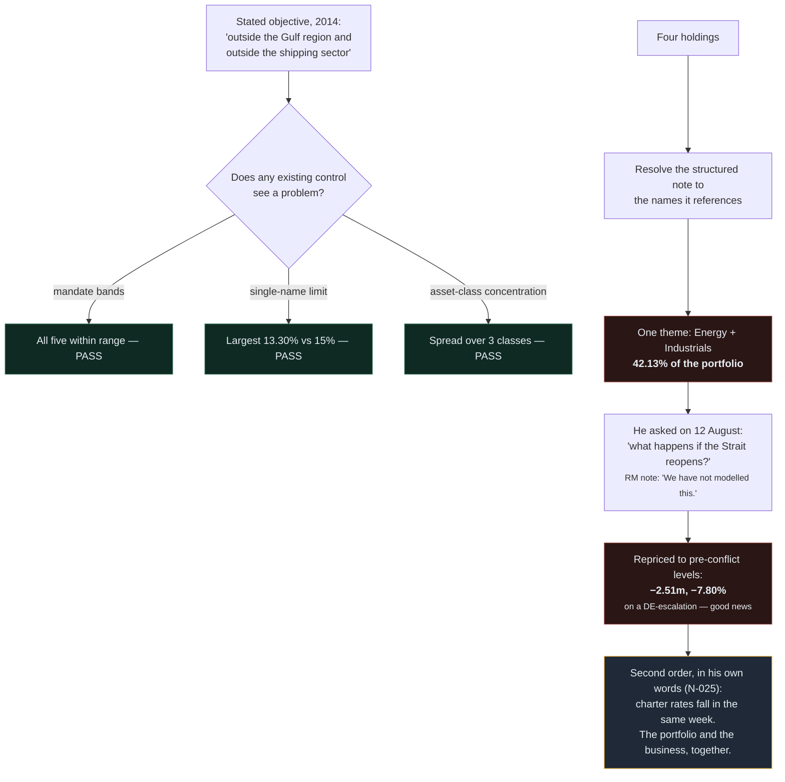
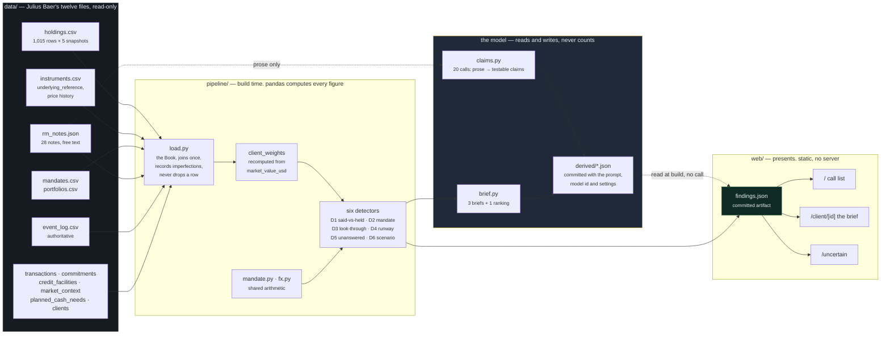

# ALAMazing — Divergence Engine

**Every bank checks the portfolio against the mandate. Nobody checks it against what the client actually *said* — so Abdullah's portfolio passes every control and is still the opposite of what he asked for.**

A wealth intelligence layer for a relationship manager with twenty clients and a morning. It reads holdings, mandates, transactions, market events and the RM's own meeting notes overnight, and answers three questions: **which client to call first, what is wrong, and how to open the conversation.**

Not a dashboard. The interesting failures in private banking are not limit breaches — they are portfolios that pass every check and are still wrong.

**[→ Open the live workbench](https://web-o0k86prrh-aljs-projects.vercel.app)**

---

## The story, in plain English

*No banking background needed for this section. Everything after it goes
deeper.*

Priscilla Ong looks after twenty wealthy families for a Swiss private
bank. Each of them has millions invested, and each told the bank, at some
point, what they wanted their money to do. She can properly keep track of
about three of them at a time.

One of her clients built his fortune in Gulf shipping — ports, cargo,
chartering vessels. When he opened his account in 2014 he asked for one
thing very clearly, and the bank wrote it down:

> Invest my money **away from the Gulf, and away from shipping.**

The reasoning is obvious once you hear it. His business already rises and
falls with Gulf shipping. If his investments do the same, then a bad year
hits him twice — once in the business, once in the portfolio. He wanted
the investments to be a cushion, not a second copy of the same bet.

**Today, 42% of his portfolio is shipping and energy.**

That is not the interesting part. The interesting part is that **nothing
at the bank noticed.** Every rule his portfolio has to follow, it follows.
Every safety limit, it respects. If you looked at any standard bank report
you would see a healthy, diversified, entirely compliant account.

It hides in plain sight for three reasons:

**It is spread across four holdings**, so no single one looks large.

**Those four sit in different categories** — a fund here, a share there —
so a report that groups by category shows a balanced mix.

**One of the four is a package deal.** He owns a product whose value is
tied to three other companies — and *two of those three are companies he
already owns directly.* On paper it looks like a fourth, different
investment. In reality it is more of the same bet, bought twice.

Add those together and it is one bet, held four ways. Our system takes
that product apart to see what is actually inside it, and the answer comes
to 42%.

Then there is the part that makes it urgent. On 12 August he asked
Priscilla a question:

> *"What happens to my portfolio if the Middle East situation calms down?"*

Her own note records the answer: **"We have not modelled this."** Nobody
got back to him.

So we worked it out. If things calm down and oil prices return to where
they were before the conflict, **he loses about 2.5 million dollars** —
7.8% of everything he has with the bank. On *good news*. And in the same
week, calmer shipping lanes mean lower shipping prices, so his business
earns less too. He said as much to Priscilla himself, in a note from
April.

The cushion he asked for in 2014 is exactly what would have protected him
here. He does not have it.

**That is the whole product**: it reads everything overnight, finds the
handful of clients where something genuinely does not add up, explains it
with the exact records it came from, and hands Priscilla a sentence she
can open the conversation with. She decides what to do — the system never
contacts a client and never moves any money.

## Summary

| | |
|---|---|
| **Live app** | [web-o0k86prrh-aljs-projects.vercel.app](https://web-o0k86prrh-aljs-projects.vercel.app) |
| **Challenge** | SingHacks 2026 · Julius Baer, Wealth Intelligence · solo build |
| **What it is** | Nine detectors that find divergence between what a client said, what their mandate permits, and what they actually hold — each finding carrying the source rows behind it |
| **Problem solved** | Bank systems only raise an alarm when a rule is broken. A portfolio can respect every allowed range for each asset type (its *mandate bands*), stay under every cap on how much can sit in one company (its *single-name limits*), and still be 42% one bet against what the client asked for — and nothing in the bank will say so |
| **How** | pandas computes every figure → findings are written to a committed JSON file → a static Next.js app renders three screens. **No live API between them** |
| **Model** | `claude-opus-5`, **24 calls in the whole system**, all at build time, all committed. It reads prose and writes prose. **It never counts** — every figure comes from pandas |
| **Core rule** | `event_log.csv` outranks the model. Where the model's recollection and the file disagree, the file wins, and explanations cite events by date from the file only |
| **Hero finding** | **42.13%** of one client's portfolio is a single shipping-and-energy bet, against a 2014 objective of *"outside the Gulf region and outside the shipping sector"* — with **every mandate band respected** |
| **Status** | All 9 specs shipped. 108 tests green, 53 findings, gates `g1`–`g3` tagged. See [Specs](#specs) |
| **Stack** | Python 3 + pandas (pipeline), Next.js 16 + TypeScript + Tailwind + shadcn/ui (workbench), pytest |

## The problem

Julius Baer's brief states the standard plainly: a team that says *"this client's bond portfolio is down USD 5.6m"* has done arithmetic. A team that explains who he is, what he told his relationship manager, and why waiting is not a plan he can outlive has understood the client.

The gap between those two is not a data problem. It is that **the problems worth a phone call usually break no rule.**

Bank systems are built to raise an alarm when something is against the rules. That catches a lot. What it cannot catch is a portfolio that follows every rule and is still the wrong portfolio for the person who owns it — because there is no alarm to raise.

Priscilla Ong runs the Asia desk. Twenty families, from USD 8.2m to 87.9m. She can properly watch about three. Every system she has waits for a rule to be broken — and the portfolio that most needs her attention this morning breaks none of them.

## A concrete example

Abdullah Al-Mansoori, 49, made his money in **Gulf logistics, port services and marine chartering**. His stated objective, typed at onboarding in 2014 and in the bank's own file ever since:

> Build wealth **outside the Gulf region** and **outside the shipping sector**; fund a family office in Asia.

Today, four holdings look like textbook diversification — two funds, one company's shares, and a *structured note* (a bank-issued product whose payout is tied to the performance of other named companies). Four holdings, three different categories.

| Position | Asset class | Weight |
|---|---|---|
| Asia Pacific Shipping and Logistics Fund | Equity | 8.88% |
| Pacific Orient Shipping Ltd | Equity (single stock) | 11.41% |
| Global Energy Majors Equity Fund | Equity | 8.94% |
| Fixed Coupon Note ref. Basket C | Structured product | 12.90% |
| **Total, once the note is opened up** | | **42.13%** |

The note is the point. The file records exactly what it is tied to — *Pacific Orient Shipping / Global Energy Majors / Bara Nusantara Energy* — and **two of those three are companies he already owns directly.**

It is also a **worst-of basket**, which is worth understanding because it inverts the intuition: when things go badly, the note pays out based on whichever of the three companies fell the *furthest*, not on their average. So it is not a fourth, diversifying investment. It concentrates the bet he already had.

Looking inside a product like this to find what it is really exposed to is called a **look-through**, and it is the single move the whole system turns on.

**Here is why nothing flags it.** His mandate — the agreement governing how the money is managed — sets an allowed range for each category. Every one is respected:

| Asset class | Actual | Band |
|---|---|---|
| Equity | 57.97% | 40–65 |
| Fixed Income | 15.67% | 15–40 |
| Structured Products | 12.90% | 0–15 |
| Cash | 7.45% | 2–15 |
| Alternatives | 6.00% | 0–25 |

Every range respected. And no single holding is too large either: the biggest is 13.30% against a 15% cap. **His portfolio passes every compliance check this bank runs, and it is 42% one bet.**



The last beat is the one that matters. **He asked a question on 12 August and nobody answered it.** Priscilla's own note records: *"We have not modelled this."* The system finds the unanswered question, and then answers it — and the answer is that **good news costs him money**. A de-escalation takes ~2.5m off the portfolio *and* reduces his charter-rate earnings in the same week, because the portfolio he asked to be uncorrelated with his Gulf business is not uncorrelated with it. He said so himself, in note N-025.

The diversification he asked for in 2014 is exactly what would have covered this. He does not have it.

Verified figures and their derivation: [`specs/001-divergence-engine/findings.md`](specs/001-divergence-engine/findings.md).

## How it works



Three things this diagram is making explicit, because each is a judged claim:

**`data/` has one arrow out.** Only `load.py` reads the filesystem. No detector can half-see a changed file mid-build.

**The model's only input is prose.** `rm_notes.json` and the objectives text reach `claims.py`; nothing else does. No holdings row, no weight, no figure. Its output is committed to `derived/` and read back at build time — **the dotted arrow makes no call.**

**`findings.json` is the only thing the web layer gets.** No `/api`, no server actions, no route handlers — verified, not assumed. The pipeline is a build-time step, so there is nothing to host and nothing to fail on stage. In a bank this is an overnight batch against core banking; today it reads a folder, in production it reads an adapter.

### The model reads and writes. It never counts.

This is the architectural spine and the answer to half the questions a banking judge will ask.

| The model does | The model never does |
|---|---|
| Read stated objectives and meeting notes | Perform arithmetic of any kind |
| Convert *"outside the shipping sector"* into a testable claim | Decide whether a claim is violated |
| Weigh which client needs a conversation soonest | Compute a weight, total or delta |
| Write four paragraphs and one opening line | Receive a raw client record or a holdings row |

**24 calls in the whole system** — 20 claim extractions, 3 briefs, 1 ranking. All at build time. All committed to `derived/*.json` alongside the prompt, the model id and the settings that produced them. **The determinism test runs with the API key removed and produces byte-identical output**, which is the proof that the demo cannot vary.

Two guards make fabrication structurally hard. A claim whose quoted words do not appear in the source text is **dropped**. A brief containing the word *"recommend"* is **rejected, not edited** — silently rewriting model output would make the committed artifact a fiction.

### What it looks for

| | Detector | Finds |
|---|---|---|
| **D1** | Said vs held | A portfolio that contradicts what the client actually told their manager. The only one that needs an AI model, and it only uses it to *read* |
| **D2** | Mandate classification | A portfolio outside its agreed ranges, and *why*: the market moved it there (**drift**), the client asked for it (**client-directed**), or — a third answer the brief does not name — **nobody chose it**, because it arrived that way |
| **D3** | Hidden when split | A single bet that only becomes visible once packaged products are opened up and holdings are added across every account |
| **D4** | Money already promised | A bill with a due date, against what could actually be sold in time. Also traces any loan secured against the portfolio — if the holdings fall, the loan gets riskier, and past a threshold the bank can force a sale |
| **D5** | The unanswered question | Something the client asked with no recorded answer. Twenty lines, and it converts the demo from analytics to advisory |
| **D6** | Scenario | What happens if a named market series returns to a past level. Arithmetic over stored prices — no forecast, no volatility assumption |
| **D7** | What happened, and why | Whether the portfolio grew because markets moved or because the client paid more in. Those are different things, and one is not performance |
| **D9** | Tax position | Paper profits and losses across everything the client holds, judged against where they are taxed rather than where they live — the two differ for seven of the twenty. Reports; never optimises |
| **D10** | Plans vs paperwork | The client's file says they need no cash access for years; their own notes describe a large bill due next year |

There is deliberately no D8 — the collateral trajectory extends D4,
because a client has one funding problem rather than a liquidity finding
and a separate collateral finding.

`detect(book, client_id)` for all of them. D6 additionally takes the market series and both dates as **arguments** — *"what if the Strait reopens"* is one call; *"what if rates fall"* is the same function with different arguments. Nothing in the pipeline names a client, an instrument, a sector, a date or a series.

### The third classification

When a portfolio ends up outside its agreed ranges, there are normally two explanations, and the brief asks us to tell them apart. Either the market moved it there while nobody was watching — **drift** — or the client asked for it — **client-directed**. The first you quietly rebalance; the second you discuss.

Reading the notes revealed a case that is neither.

Margarethe Voss-Brenner's portfolio is **71.46% equity against a 30% ceiling** on a Conservative mandate. She has never traded. It was transferred in as it stood when her husband died in February. **Nobody chose this allocation for her** — not the bank, and not her.

So the system reports a third class, `inherited`. Same breach, a different conversation — and one that cannot be had the way the other two are had, because she has said twice that she does not understand what is in the portfolio.

## Against the brief's own menu

The challenge brief lists *"Directions the Data Supports"* and calls it
**"a menu, not a checklist — two or three done well beats all of them done
thinly."** We built seven, and the two we declined are declined on the
record rather than quietly missing.

| Direction | Where |
|---|---|
| **Hidden risk** — a bet spread across accounts, or buried inside a packaged product | D3 |
| **Mandate governance** — did the market cause this, or did the client ask for it | D2, plus a third answer: *nobody chose it* |
| **Liquidity** — money already promised, against what could be sold in time | D4 |
| **Collateral** — how risky a loan secured against the portfolio has become, over time | D4's trajectory |
| **Scenario** — what if the Middle East de-escalates | D6 |
| **Explanation** — why the portfolio moved, tied to real events | D7 |
| **Tax-aware** — paper gains and losses together, judged where the client is taxed rather than where they live | D9 |
| **Life events** — futures the allocation was not built for | D10 |
| **Prioritisation** — who to call first, defensibly | The ranked call list |

**Two things we deliberately do not do**, and they are positions rather
than omissions:

**We do not recommend trades.** The brief's flow says *"Recommend
Potential Actions"* and Building Block 3 lists rebalancing suggestions. We
draft the *conversation*, not the trade. A rebalancing suggestion from a
system that has never met the client is the thing an RM has to undo — and
the brief's own Trust section asks for solutions that *"support human
decision-making rather than replace it"*. Priscilla gets the finding, the
evidence, and a sentence she can open with, and she keeps, rejects or
annotates every one.

**We do not optimise tax.** D9 reports the position and stops. One client
is sitting on HKD 62.6m of paper losses. In most countries you would
deliberately sell some of those to offset a tax bill — the standard move,
called harvesting. But he is taxed in Hong Kong, which does not tax
investment gains at all, so selling at a loss saves him nothing. Telling him to harvest would be confidently wrong in front of someone who
understands his own tax affairs far better than we do. **The finding that
says "don't" is the valuable one.**

## Why you can trust it

**Every finding carries its evidence.** Source file, row identifiers, values. A detector that cannot produce evidence returns nothing — there is no such thing as an unsourced finding here. The evidence panel is visible without interaction on desktop, because hiding it undercuts the whole claim.

**Determinism is tested, not asserted.** Two builds, byte-identical output, with the model key removed. And separately: the written file is checked to contain the recorded figures — because *a deterministic build of the wrong numbers is still deterministic.*

```
108 passed in 8.00s
```

**We report data problems rather than working around them.** Julius Baer's brief asks for this explicitly, and the uncertainty screen keeps two kinds of not-knowing apart: **10 data imperfections** (the files cannot tell us) and **26 method limits** (our approach has a boundary).

The sharpest one: `SYN-ST-0107` Nordvind Industrial AB carries **no cost basis** for CL-0003. It is not a reference-data gap — another client holds the same stock with a full basis and a +93% gain, acquired 2011. What is missing is the basis for *her* position, because the transfer carried a date and a value but not a history. So the bank knows what that stock cost in 2011 and **cannot tell her what her holding cost** — which becomes a tax problem the moment she sells it, and selling it is one of her options for a EUR 3.4m instalment due before year end.

**Things the reference documents got wrong, found and recorded rather than papered over:**

- Three portfolios are **custody accounts**. Applying mandate bands to them produced a *100% "alternatives breach" on a client's own founder shareholding.* Telling a founder their portfolio breaches its equity limit when the position **is** the company they founded is not a finding.
- The data carries a flag saying which instruments the single-company cap
  even applies to, and we were ignoring it — so the cap was being applied
  to **broad index funds**, which exist precisely to spread risk. Those
  false alarms then *buried a real one*: an actual single-stock breach was
  listed second, underneath a fund that was never in breach at all.
- The structured note is **par-indexed to 100.0** before it existed. Repricing off that backfilled value understated the scenario by a third — plausibly, and invisibly. The gate has to be whether the client *held* it, not whether a price exists.

Each of these is recorded in the relevant spec's `research.md` with the query that found it.

## The workbench

Three screens, reading one file. It is deliberately designed to feel like a **printed note a banker reads before a meeting** — not a dashboard and not a trading screen. Priscilla reads it in a lift, on a phone, five minutes before she sees the client.

Below is the client page. On the left, what she needs to know, in the order she needs it. On the right, the exact records behind every sentence — so she can check any claim before repeating it to a client.

```
┌──────────────────────────────────────────────┬──────────────────────────┐
│ Abdullah Al-Mansoori                         │ EVIDENCE                 │
│ Balanced Growth · advisory                   │                          │
│ USD 32.2m · client since 2014 · age 49       │ holdings.csv             │
│                                              │   SYN-EQ-0008   8.94%    │
│ ! He asked you a question on 12 August.      │   SYN-EQ-0025   8.88%    │
│   It has no answer yet.                      │   SYN-SP-0505  12.90%    │
│                                              │   SYN-ST-0104  11.41%    │
│ What he asked us for, in 2014, was wealth    │                          │
│ outside the Gulf and outside shipping.       │ instruments.csv          │
│                                              │   underlying_reference:  │
│ FOUR HOLDINGS, OPENED UP                     │   "Worst-of basket:      │
│   Shipping fund .............  8.9%          │    Pacific Orient /      │
│   Pacific Orient (shares) ... 11.4%          │    Global Energy /       │
│   Energy fund ...............  8.9%          │    Bara Nusantara"       │
│   Structured note ........... 12.9%          │                          │
│   ------------------------------------       │ event_log.csv            │
│   One bet, held four ways ... 42.1%          │   2026-03-04  Strait     │
│                                              │   2026-08-05  blockade   │
│ MANDATE — the agreed ranges                  │                          │
│   Equity            57.9    40-65  ok        │ rm_notes.json            │
│   Fixed income      15.6    15-40  ok        │   N-025 "the point of    │
│   Structured        12.9     0-15  ok        │    the Asia portfolio    │
│   Cash               7.4     2-15  ok        │    was to be uncorre-    │
│   Alternatives       6.0     0-25  ok        │    lated with the Gulf   │
│                                              │    business. It          │
│   Every range respected. Largest single      │    currently is not."    │
│   holding 13.3% against a 15% cap.           │                          │
│   Nothing here breaks a rule.                │   N-026 "He asked for a  │
│                                              │    view on what happens  │
│ IF OIL RETURNS TO PRE-CONFLICT LEVELS        │    if the Strait reopens │
│   -0.43m   -0.73m   -0.54m   -0.82m          │    and normalises. We    │
│   Total  -2.51m   = -7.80% of the book       │    have not modelled     │
│   ...on good news.                           │    this."                │
├──────────────────────────────────────────────┴──────────────────────────┤
│ WORTH OPENING WITH                                                      │
│                                                                         │
│ "Abdullah, you asked us in August what happens to this                  │
│  portfolio if the Strait reopens — we've now put numbers                │
│  to it, and I'd like to start there."                                   │
│                                                                         │
│ [ Keep for the meeting ]   [ Not useful ]   [ Add a note ]              │
└─────────────────────────────────────────────────────────────────────────┘
│  ┌──────────────────────────────┬────────┐ │  event_log.csv           │
│                                                                       │
│  └──────────────────────────────┴────────┘ │   2026-08-05 blockade    │
│                                            │                          │
│  MANDATE — the agreed ranges               │  rm_notes.json           │
│  Equity        ▓▓▓▓▓▓                                                 │
│  Fixed Income  ▓▓                                                     │
│  Structured    ▓                                                      │
│  Cash          ▓                                                      │
│  Alternatives  ▓                                                      │
│  ┌────────────────────────────────────────┐│    currently is not."    │
│                                                                       │
│                                                                       │
│                                                                       │
│  └────────────────────────────────────────┘│   if the Strait reopens  │
│                                            │   and normalises. We     │
│  IF OIL RETURNS TO PRE-CONFLICT LEVELS     │   have not modelled      │
│  −0.43m  −0.73m  −0.54m  −0.82m            │   this."                 │
│  ┌──────────────────────┐                  │                          │
│                                                                       │
│  └──────────────────────┘                  │                          │
├────────────────────────────────────────────┴──────────────────────────┤
│  WORTH OPENING WITH                                                   │
│                                                                       │
│  "Abdullah, you asked us in August what happens to this portfolio     │
│   if the Strait reopens — we've now put numbers to it, and I'd        │
│   like to start there."                                               │
│                                                                       │
│  [ Keep for the meeting ]  [ Not useful ]  [ Add a note ]             │
└───────────────────────────────────────────────────────────────────────┘
```

**Priscilla decides.** The system proposes, explains and drafts. It never contacts a client or executes anything. Every finding is keepable, rejectable or annotatable, and **rejection records a reason** — a rejection without one teaches the system nothing and tells her successor nothing.

Those decisions persist to the browser's local storage. There is no server by design, so that is the honest scope: they survive a reload, they do not reach a CRM.

The word *"recommend"* appears nowhere in the RM-facing copy — *"worth raising"*, *"you may want to check"*, *"worth opening with"*. That is a Julius Baer positioning point, not a style preference: the RM is the adviser.

`/` the call list · `/client/[id]` the brief · `/uncertain` what we are not sure about. Responsive at 920px, readable to 375px. Source: [`.alamazing/mockup.html`](.alamazing/mockup.html), [`design/design-notes.md`](design/design-notes.md).

## Running this in a bank

Most teams skip this section. It is a quarter of the score.

> This runs as an overnight batch against the bank's own systems — holdings from core banking, notes from CRM, events from research. Today it reads a folder; in production it reads an adapter. The detectors take a book and a date; nothing in them names a sector.
>
> The detection logic is **production-shaped**: deterministic, auditable, evidence-carrying, no live inference. What is not built is the integration layer and the deployment controls — known work, not unknowns.
>
> First deployment would be the look-through and the scenario, because they run on holdings and prices alone and need no notes. The notes layer comes second, once the CRM is worth reading.
>
> The real dependency is note quality. This works because Priscilla records what clients *said*, not just what was decided. An RM who writes "annual review, all fine" gives the notes detector nothing. That is change management, not engineering.

**Never "production ready".** The phrase is prohibited by this project's own constitution, because it would be false.

## Project structure

```text
alamazing-singhacks-2026/
├── pipeline/               Python. Computes every figure.
│   ├── load.py                the Book — twelve files, joined, imperfections recorded
│   ├── mandate.py             band comparison, shared by specs 001 and 003
│   ├── fx.py                  unit-aware currency conversion
│   ├── claims.py              prose → testable claims (the only model call in detection)
│   ├── brief.py               briefs and the call-list ranking
│   ├── build.py               CLI → web/public/findings.json
│   └── divergence/            d1_said, d2_mandate, d3_hidden,
│                              d4_runway, d5_unanswered, d6_scenario,
│                              d7_explain, d9_tax, d10_lifeevents
├── derived/                Committed model output — claims, briefs, ranking,
│                              each with the prompt and settings that produced it
├── web/                    Next.js. Presents. Reads one static file.
│   ├── app/                   / , /client/[id] , /uncertain
│   ├── components/            mandate panel, exposure figure, evidence, decisions
│   └── public/findings.json   the committed artifact
├── tests/                  88 assertions. Unit, integration, end-to-end
├── specs/                  One directory per spec — spec → plan → tasks →
│   └── NNN-feature/           research, with every figure's derivation
├── data/                   Julius Baer's twelve files. Never written to
└── .specify/memory/        The constitution — 15 principles every spec is
                               checked against
```

## Specs

Built spec-first: every feature goes through `/speckit.specify → /speckit.plan → /speckit.tasks → implement`, and **no spec starts until the previous one's acceptance figure is verified** — not until its code exists.

| # | Spec | Model? | Status |
|---|---|---|---|
| — | [Constitution](.specify/memory/constitution.md) | — | v1.2.0, amended twice during the build |
| 000 | [Data layer](specs/000-data-layer/) | no | Shipped · `g1` |
| 001 | [Look-through concentration](specs/001-look-through/) | no | Shipped |
| 002 | [Said vs held](specs/002-said-vs-held/) | **yes** | Shipped |
| 003 | [Mandate classification](specs/003-mandate-classification/) | no | Shipped |
| 004 | [Liquidity and the unanswered question](specs/004-liquidity-unanswered/) | no | Shipped |
| 005 | [Scenario](specs/005-scenario/) | no | Shipped · `g2` |
| 006 | [Briefs and build](specs/006-briefs-build/) | **yes** | Shipped |
| 007 | [The workbench](specs/007-workbench/) | no | Shipped · `g3` |
| 008 | [Explanation, collateral, tax, life events](specs/008-explanation-collateral-tax-life/) | no | Shipped — four detectors from an audit against the official brief |

**Seven of nine specs need no model at all.**

Each spec directory carries a `research.md` recording every question that had to be answered from the data before code was written, with the query that answered it. That is where the four reference-document errors and two shipped defects are documented — including the two the constitution itself needed, which is why it is at v1.2.0 rather than v1.0.0.

## Getting started

```bash
# Pipeline
python3 -m venv .venv && source .venv/bin/activate
pip install -r requirements.txt

# Rebuild findings.json. --series is required: the scenario is the
# question being asked, not a property of the pipeline.
python pipeline/build.py --data data/ \
  --clients CL-0019,CL-0003,CL-0014 --series BRENT_USD_BBL

# Tests
python -m pytest tests/ -v

# Workbench
cd web && npm install && npm run dev
```

The build reads committed model output from `derived/` and **makes no model call** — it completes with no API key set. Regenerating briefs, claims or the ranking is an explicit action, never a side effect of running the pipeline.

`.env.local` holds the Anthropic key for regeneration only. Never committed — see `.gitignore`.

## What we did not do

Honest scope, decided in advance and written into the constitution rather than rationalised afterwards:

- **No chat interface.** Not in the three minutes.
- **No authentication or database.** One hardcoded RM; JSON on disk.
- **No real market data.** `market_context.csv` is sufficient and authoritative.
- **No portfolio optimiser.** Not the contribution — and Priscilla decides, not us.
- **No separate mobile app.** Responsive web is the same demo at a fraction of the cost.
- **No charts without a finding attached.** Decoration.
- **Not all twenty clients in depth.** The brief instructs the opposite. Three are briefed; the other seventeen get the mandate and look-through checks so the call list is real rather than a mock of three.
- **Not CL-0012.** He is the brief's own worked example, so every team will demo him. Avoiding him is a deliberate choice, not an oversight.

## A short glossary

Everything the README uses, in one place. Terms are explained where they
first appear too — this is for anyone reading out of order.

| Term | What it means here |
|---|---|
| **Relationship manager (RM)** | The banker who owns the client relationship. Priscilla. She gives the advice; this system only prepares her for the conversation |
| **Mandate** | The agreement setting how the money is managed. It fixes an allowed percentage range for each category of investment |
| **Mandate band** | One of those allowed ranges. "Equity 40–65" means between 40% and 65% of this portfolio should be shares |
| **Single-name limit** | A cap on how much can sit in any one company. Stops a portfolio quietly becoming one bet |
| **Structured note / product** | A product issued by a bank whose payout depends on the performance of other named investments. Useful, and easy to misread — it looks like one holding while behaving like several |
| **Worst-of basket** | A structured product tied to several companies where, on the downside, the payout follows whichever fell *furthest* — not the average. Riskier than it first appears |
| **Look-through** | Opening a packaged product up to see what it is actually exposed to, rather than accepting the label on the outside |
| **Concentration** | Too much riding on one thing — one company, one industry, one country |
| **Drift** | A portfolio moving outside its agreed ranges because markets moved, not because anyone decided |
| **Client-directed** | The same result, but because the client asked for it. A different conversation |
| **Liquidity** | How quickly a holding can be turned into cash without a discount. A daily-traded fund is liquid; an apartment is not |
| **Collateral** | Holdings pledged against a loan. If they fall in value the loan becomes riskier |
| **Loan-to-value (LTV)** | What is owed as a percentage of what the pledged holdings are worth to the lender. Rises when the loan grows *or* the holdings fall |
| **Margin call** | Past an agreed LTV, the bank can demand cash or sell the holdings itself. The one event that removes the client's choice entirely |
| **Unrealised gain / loss** | A profit or loss on paper, because the holding has not been sold. It becomes real — and usually taxable — on sale |
| **Harvesting** | Deliberately selling at a loss to offset tax on gains elsewhere. Standard practice — and pointless where investment gains are not taxed |
| **Tax domicile** | The country whose tax rules apply to someone, which is not always where they live. Seven of these twenty clients differ on the two |
| **Snapshot** | A dated photograph of every holding. This dataset has five, from December to August, which is what makes change and cause visible |
| **Evidence** | For us, a specific thing: the file, the row identifiers and the values behind a statement. A finding without it is not shown |

## Further reading

- Governing principles — 15 articles every spec is checked against: [`.specify/memory/constitution.md`](.specify/memory/constitution.md)
- The three clients with verified figures and their derivation: [`specs/001-divergence-engine/findings.md`](specs/001-divergence-engine/findings.md)
- Module-by-module implementation notes: [`specs/001-divergence-engine/implementation.md`](specs/001-divergence-engine/implementation.md)
- The three-minute demo script, beat by beat: [`docs/demo-script.md`](docs/demo-script.md)
- Visual direction and component rules: [`design/design-notes.md`](design/design-notes.md)
- Gates, with the time each passed: [`docs/gates.md`](docs/gates.md)
