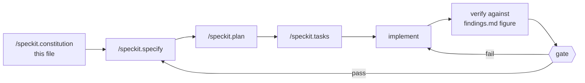

# ALAMazing — All Specs

**Team:** ALAMazing · **Product:** Divergence Engine
**Repo:** `alamazing-singhacks-2026`
**SingHacks 2026 · Julius Baer Wealth Intelligence · solo · ~10 hours**

Nine paste blocks: one constitution, eight specifications. Run them top to
bottom. After each `/speckit.specify`, run `/speckit.plan`, then
`/speckit.tasks`, then implement — and verify the acceptance figure before
starting the next.

Setup commands are in `RUN-SHEET.md`. Governance is in
`.specify/memory/constitution.md`. Verified figures are in
`.alamazing/findings.md`.

| Block | Spec | Model? | Gate |
|---|---|---|---|
| 0 | The spine — reproduce 42.134 | — | before anything |
| 1 | `/speckit.constitution` | — | — |
| 2 | 000 data layer | no | G1 |
| 3 | 001 look-through concentration | no | G2 |
| 4 | 002 said vs held | **yes** | G2 |
| 5 | 003 mandate classification | no | G2 |
| 6 | 004 liquidity + unanswered question | no | G2 |
| 7 | 005 scenario | no | G2 |
| 8 | 006 briefs and build | **yes** | G3 |
| 9 | 007 the workbench | no | G3 |

**Six of eight specs need no model at all.**

---

## 0 — Before anything: prove the gate

```python
import pandas as pd
h = pd.read_csv('data/holdings.csv')
t = h[(h.client_id=='CL-0019') & (h.snapshot_date=='2026-08-26')]
w = t.market_value_usd / t.market_value_usd.sum() * 100
print(round(w[t.instrument_id.isin(
    ['SYN-EQ-0025','SYN-ST-0104','SYN-EQ-0008','SYN-SP-0505'])].sum(), 4))
```

Must print `42.1343` or `42.1344` — the fourth decimal varies with float
summation order. Anything else means something is wrong; stop, because
everything downstream assumes this number.

---

## 1 — `/speckit.constitution`

```
Create the constitution for alamazing-singhacks-2026 — ALAMazing, the Divergence Engine. Use the content below verbatim. Keep every principle name, every Rationale block, every MUST/MUST NOT, every table, the Definition of Done, the Gates, the Kill switch, and the Governance section. Do not compress, summarise, or reorder.

# Constitution — alamazing-singhacks-2026

**Official title: ALAMazing — Divergence Engine.** This file keeps the
repo name as its identifier; the title above is the display name used in
the README and the pitch.

**Scope:** One project, one build. SingHacks 2026, Julius Baer Wealth
Intelligence challenge. Solo. **Submission 18:00 SGT Saturday 5 September.
Feature freeze 16:00.**

---

## Preamble

This is a hackathon constitution, not a product one. It inherits the
governance core used across this team's spec-driven work and deliberately
suspends the parts that only pay off over months. Where the standing
methodology and the clock conflict, this document says which wins, so
nothing is relitigated at 15:00 under pressure.

The failure mode being governed against is not bad code. It is **twenty
clients summarised competently and nothing anyone remembers at 18:10.**

Julius Baer stated the standard themselves: a team that says *"this
client's bond portfolio is down USD 5.6m"* has done arithmetic. A team
that explains who he is, what he told his relationship manager, and why
waiting is not a plan he can outlive has understood the client. **The
second wins even when the first number is more precise.**

---

## Core Principles

### I. Demo Primacy

The deliverable is a **three-minute demonstration**, not a repository.
Every task MUST be judged by one question: does this change what the
judges see? Work that does not reach the screen is out of scope, however
correct it is.

The demo script is written **before** the code — `.alamazing/demo-script.md`
— and the client brief screen (S2) MUST be built before any other screen.

**Rationale**: Two of the four judging criteria (User Experience and
Design, and the presentation component of Strategic Impact) are assessed
entirely from what appears on screen in three minutes. A correct pipeline
with no rendered brief scores zero on half the rubric.

### II. Specification First, Time-Boxed

No implementation before the specification is written. All eight specs
are drafted in `alamazing-all-specs.md`. **Editing a spec mid-build is capped at ten
minutes.** An unfinished edit at the cap MUST be closed with an explicit
recorded assumption rather than extended.

Specifications state **what and why**. Column names, function signatures
and library choices belong in `.alamazing/implementation.md`.

**Rationale**: The cap is the rule, not a suggestion. Spec drift under
time pressure is how a solo build arrives at 16:00 with three
half-implemented interpretations of the same feature.

### III. The Spine Rule

The single riskiest assumption MUST be proven with the ugliest possible
script **before any feature work begins**. No UI, no abstraction, no error
handling.

The spine for this project is one number: **the pipeline produces
42.134 (± 0.001) for CL-0019 from the raw files.** That is the look-through
concentration on which the entire product rests. Six lines of pandas
prove it.

If the spine does not hold, no downstream work is authorised until it
does.

**Rationale**: Every finding, every screen and every sentence of the
pitch assumes that number is reachable. Discovering at 13:00 that it is
not is unrecoverable; discovering it at step 9 of setup costs ten minutes.

### IV. Nothing Is Invented

Portfolio facts MUST come from the twelve files in `data/` or they do not
exist. No external market data, no model recollection, no plausible
inference presented as fact.

`event_log.csv` is **authoritative** for anything that occurred in 2026.
Where the model's recollection and the file disagree, the file wins.
Explanations MUST cite events by their date and description from the file
only.

**Rationale**: Julius Baer wrote the reason into the brief — *a real
advisory system cannot let a language model free-associate about
geopolitics in front of a client.* Grounding in a controlled, auditable
event source is the difference between an explanation defensible in a
compliance review and one that merely sounds plausible. The judges
authored this dataset and will recognise an invented event immediately.

### V. The Model Reads and Writes. It Never Counts.

| The model MUST | The model MUST NOT |
|---|---|
| Read prose — stated objectives, RM notes | Perform arithmetic of any kind |
| Convert a stated wish into a testable claim | Decide whether a claim is violated |
| Weigh which finding matters for this person | Compute a weight, total or delta |
| Write three paragraphs and one opening line | Receive a raw client record |

Every figure in every output MUST be computed by deterministic Python.
The model receives derived findings only.

**Rationale**: This is the architectural spine and the answer to half the
questions a banking judge will ask. It keeps the numbers reproducible,
keeps client data out of the model's context, and gives a regulator asking
*"why did your system say this on 26 August"* the same answer twice. It is
also what makes the product honest — the AI is doing the thing only an AI
can do (reading prose), and nothing else.

### VI. Evidence Over Assertion

Every finding MUST carry its sources: file, row identifiers, values, and
any `event_log` entries relied upon.

**A detector that cannot produce evidence MUST produce nothing.** There is
no such thing as an unsourced finding. Correct logic with missing evidence
is a defect, not a feature.

The evidence panel MUST be visible without interaction on desktop.

**Rationale**: Traceability is the whole difference between this and a
plausible-sounding chatbot, and it is most of the Technical and
Operational Feasibility criterion. A verdict shown without the evidence
behind it is exactly what the brief warns against as confident
fabrication.

### VII. Determinism

Identical inputs MUST produce identical output. Always.

Briefs are generated at **build time** and committed to `findings.json`.
No model call occurs at demo time. Model temperature MUST be 0 and the
prompt MUST be committed alongside its output.

**Rationale**: A regulated advisory system cannot answer differently on
different days. It is also why the demo cannot fail on stage — the same
reason Antabay locked SEL→TYO and Rewind pre-warmed its sandboxes. There
is nothing running to fail.

### VIII. Evidence-Based Test Pyramid

The standing team split is 70/20/10 unit/integration/e2e. That shape is
retained; the volume is compressed and stated in **absolute counts**,
because a percentage target on a ten-hour build produces either theatre
or an excuse.

| Layer | What it covers | Count | When |
|---|---|---|---|
| **Unit (~70%)** | Pure logic with no file or model access: `underlying_reference` parsing, client-level weight recomputation, band comparison, breach classification, liquidity tiering, scenario repricing | ~14 assertions, sub-second | Alongside each detector |
| **Integration (~20%)** | Each detector against **real rows from `data/`**, asserted to the figure recorded in `.alamazing/findings.md` | ~4 tests | At the end of each of specs 001–005 |
| **E2E (~10%)** | `build.py` end to end, twice, asserting identical output; plus the rendered brief containing the expected figure | 2 tests | At G3, re-run before freeze |

**The integration layer is redefined for this project.** There are no
external services at demo time, so "integration" does not mean contract
tests against a vendor. It means the detector runs against the actual
Julius Baer files and produces the actual number.

**Every integration assertion MUST cite a figure from
`.alamazing/findings.md`**, which records how each was computed. A test
asserting a number with no recorded derivation is not evidence-based and
does not count toward this article.

Required assertions, non-negotiable:

| Test | Asserts |
|---|---|
| `test_lookthrough_cl0019` | 42.134 ± 0.001 |
| `test_lookthrough_cl0014` | 29.46 ± 0.01 (Golden Harbour across three asset classes) |
| `test_mandate_cl0003_inherited` | Equity 71.46 vs 10–30, classification `inherited` |
| `test_mandate_cl0019_clean` | No breach; `compliance_clean` is True |
| `test_scenario_cl0019` | −2.5m ± 0.1m, −7.8% ± 0.2 |
| `test_findings_are_deterministic` | Two builds, identical output |

**What is NOT tested**: UI rendering, error paths outside the demo script,
model output quality, and anything already declared out of scope. A test
that prevents a bug more cheaply than it costs is discipline; any other
test is theatre — and this track has no technical-depth criterion to
reward it.

**Rationale**: Weighting toward the cheapest layer keeps feedback fast.
Stating counts rather than percentages makes the article checkable at
16:00 by counting, not by running a coverage tool nobody has time to read.

### IX. The Relationship Manager Decides

Julius Baer's stated positioning is *high-touch, relationship-driven,
digital assisted*. Retail banking is digital-first; wealth management
explicitly is not.

- The system MUST propose, explain and draft. It MUST NOT contact a client
  or execute any action.
- Every finding MUST be keepable, rejectable or annotatable. Rejection
  MUST record its reason.
- RM-facing copy MUST NOT use the word "recommend". Use *worth raising* or
  *you may want to check*.
- Where an RM note disagrees with the data, **both MUST be shown.** Her
  note is never overruled; the disagreement is surfaced for her to
  resolve.

The system is framed as *one more specialist on her bench* — their own
material describes an RM "supported by a team of specialists". It is never
framed as an assistant, a copilot, or a Jarvis.

**Rationale**: Strategic Impact is 25% and is explicitly about preserving
the RM's central role. A system that decides for Priscilla fails the brief
even if every number is right.

### X. Honest Framing

The system MUST be described as what it does, not what it would do given
a week. Roadmap MUST be labelled roadmap, in the README and out loud.

Two specific obligations, both stated in the challenge brief:

**Uncertainty is stated, not smoothed.** Where evidence does not support a
conclusion, the system MUST say so and name what it would check. The
uncertainty screen exists for this.

**Data problems are reported, not worked around.** Their words: *if
something in the data looks wrong or contradictory, say so in your
presentation. Noticing is worth more than quietly working around it.*
Nordvind Industrial AB carries no cost basis through its transfer-in; this
MUST be stated on stage.

**Rationale**: Confident fabrication is called out in the brief as
scoring badly. The judges authored the data, including its imperfections,
and are watching for whether they were noticed.

### XI. Vertical Slices Only

Build end-to-end thin, then thicken. **From Saturday 13:00 there MUST
always exist a runnable path from `data/` to a rendered brief.**

The cheapest version comes first: one hardcoded client, one finding, no
styling. A component that cannot be demonstrated on its own MUST NOT be
started until the spine is complete.

**No refactoring after 16:00. None.**

### XII. Declared Scope

The following are **out of scope permanently** and MUST NOT be built,
however much time appears to remain:

| Not building | Why |
|---|---|
| Chat interface | Not in the three minutes |
| Authentication | Single hardcoded RM |
| Database | JSON on disk survives two days |
| Real market data | `market_context.csv` is sufficient and authoritative |
| Portfolio optimiser | Not the contribution |
| Separate mobile application | Responsive web is the same demo at a fraction of the cost |
| Charts without a finding attached | Decoration; Principle I excludes it |
| All twenty clients in depth | The brief instructs the opposite |

**Rationale**: A ceiling stated in advance is a ceiling. Every item here
was considered and rejected on time-cost grounds, so none needs
re-deciding at 14:00.

### XIII. Design Is A Quarter Of The Score

Four criteria at 25% each: Client-Centric Innovation, User Experience and
Design, Technical and Operational Feasibility, Strategic Impact. **There
is no technical-depth criterion on this track.**

Architecture for its own sake earns nothing here. **One hour of rehearsal
is worth one hour of features and MUST be budgeted as such.**

The design system exists at `.alamazing/mockup.html` and MUST be built
against literally rather than improvised.

**Rationale**: This inverts the usual hackathon instinct, which is why it
is written down. Half this score is design and delivery; the freeze is
16:00 rather than 17:30 for that reason alone.

### XIV. Living Evidence

The repository MUST be public from the first commit. Each gate MUST be
recorded as a git tag at the moment it passes, and as one line with its
time in `docs/gates.md`.

**Rationale**: A methodology with no evidence of having been followed is
a blog post. Julius Baer are recruiting at this event; a commit history
showing spec-driven discipline over ten hours is an artifact in its own
right.

---

## Technology Standards

**Python + pandas for all computation; TypeScript + Next.js for all
presentation.** The two meet at a single committed artifact,
`web/public/findings.json`. No live API between them.

**No database.** JSON files on disk. A schema migration at 02:00 is a
failure mode this project cannot absorb.

**shadcn/ui is the component library** — Radix primitives styled with
Tailwind, copied into the source tree via `npx shadcn@latest add`, not
npm-installed as a package. Tokens are fixed in `.alamazing/globals.css`
and MUST NOT be redefined per component.

**Streamlit and Chainlit MUST NOT be used.** Both are recommended on the
event resource page and both concede User Experience and Design, which is
25% of the score.

**`weight_pct` in `holdings.csv` is per-portfolio, not per-client.**
Client-level exposure MUST be recomputed from `market_value_usd`. This is
recorded as a standard rather than a note because it is the single most
likely source of a silent wrong number in this dataset: clients holding
several portfolios return plausible but incorrect figures if the column is
summed directly.

**Model calls MUST run at build time only, at temperature 0, with the
prompt committed alongside its output.** Four calls exist in the whole
system: three briefs and one ranking.

---

## Development Workflow



A stage MUST NOT be skipped. **A spec MUST NOT be started until the
previous spec's acceptance figure has been verified**, not merely until
its code exists.

Spec order is fixed: 000 → 001 → 002 → 003 → 004 → 005 → 006 → 007.
Spec 001 precedes 002 because 002 consumes `look_through()`.

---

## Definition of Done

A specification is not complete until all of the following hold:

1. Unit assertions for its pure logic pass (Principle VIII).
2. Its integration assertion passes against the figure recorded in
   `.alamazing/findings.md` (Principles VI and VIII).
3. Every finding it emits carries file, row identifiers and values
   (Principle VI).
4. No arithmetic in it is performed by a model (Principle V).
5. Any event it cites resolves to a row in `event_log.csv` (Principle IV).
6. Its RM-facing copy contains no instance of "recommend" (Principle IX).
7. Anything it could not determine is recorded in `unsure_about` rather
   than omitted or guessed (Principle X).
8. It is committed with its spec number in the message and, where it
   closes a gate, tagged (Principle XV).

A specification missing any one of these is not done, regardless of how
much of the remaining work is complete.

---

## Gates

| Gate | When | Passes when | Tag |
|---|---|---|---|
| **G1 — Data** | Fri 21:00 | Spec 000 Definition of Done met; 42.134 reproduced from raw files | `g1` |
| **G2 — Findings** | Sat 13:00 | Specs 001–005 done; all six required assertions green | `g2` |
| **G3 — Screens** | Sat 16:00 | Three screens render real findings; deployed and reachable from a phone on mobile data | `g3` |
| **G4 — Shipped** | Sat 17:45 | Rehearsed three times, video recorded, README written, submitted | `g4` |

### Kill switch

Declared scope is a ceiling, never a floor. Cutting is the default
response to trouble.

| Time | Checkpoint | If not met |
|---|---|---|
| Fri 21:00 | Spec 000 passes | Nothing else starts. Fix this first |
| Sat 11:00 | Specs 001 and 002 emitting findings | Cut spec 004 |
| Sat 13:00 | `findings.json` written; one brief renders | Cut to one client — Abdullah only |
| Sat 15:00 | Three screens up | Cut S3, then degrade S1 to a static list |
| **Sat 16:00** | **Feature freeze** | Stop building. Unfinished work becomes roadmap |
| Sat 17:00 | Rehearsed twice, video recorded | Simplify the path until it survives two clean runs |

**Never cut**: spec 000, spec 001, Abdullah Al-Mansoori, the mandate
panel, the evidence panel, rehearsal.

### The side challenge

A second Julius Baer challenge is released **Saturday 14:00**, four hours
before submission. It MUST be read for five minutes and then assessed
against this gate. It MAY be attempted **only if all four hold**:

1. Specs 001–005 are emitting findings
2. One full rehearsal is complete, aloud and timed
3. The main build requires no further features
4. It reuses the existing pipeline with no new dependency

If any is false, it MUST be declined and "declined 14:00" recorded in
`docs/gates.md`. If attempted: **sixty minutes hard**, separate branch,
and the main pitch does not mention it.

**Declining is the correct default.**

---

## Gate Authority

Solo build. Gates are self-attested and recorded as git tags with a
timestamp in `docs/gates.md`. **The recording is the control**, not a
second signature — a gate claimed but not tagged did not pass.

---

## Governance

This constitution supersedes informal conventions and any duplicate copy
embedded elsewhere in project documentation. Where `RUN-SHEET.md`,
`alamazing-all-specs.md` or any spec disagrees with this file, **this file governs**
until the conflicting document is corrected.

**Amendment procedure**: Amendments state their rationale. On amendment,
the Sync Impact Report at the top of this file MUST be updated, and the
version and date fields below MUST change in the same edit. During the
build window, an amendment additionally requires stopping and recording
the time — that friction is intentional.

**Versioning policy**: Semantic versioning. MAJOR marks a removed or
redefined principle. MINOR marks an added principle or material expansion
of existing guidance. PATCH marks wording and clarification only.

**Open clarifications**: NONE. Every figure this project asserts has been
computed from `data/` and recorded in `.alamazing/findings.md`. Every
scope question is closed in Principle XIII. Any new open question found
during the build MUST be closed within ten minutes with a recorded
assumption, per Principle II.

---

## The one line

> Every bank checks the portfolio against the mandate. Nobody checks it
> against what the client actually **said** — so Abdullah's portfolio
> passes every control and is still the opposite of what he asked for.

---

**Version**: 1.0.0 | **Ratified**: 2026-09-04 | **Last Amended**: 2026-09-04
```

**After it generates, verify these survived** — Spec Kit compresses:

```bash
grep -c "MUST" .specify/memory/constitution.md          # expect 30+
grep -n "Definition of Done" .specify/memory/constitution.md
grep -n "test_lookthrough_cl0019" .specify/memory/constitution.md
grep -n "Rationale" .specify/memory/constitution.md            # expect 14
```

If Principle V (the model never counts), Principle VIII (the pyramid table),
or the Definition of Done came back thinner, paste them back by hand.

---

## 2 — `/speckit.specify` — spec 000, data layer

```
Build the data layer for the Divergence Engine.

CONTEXT
Twelve files in data/. 20 clients, 24 portfolios, 1,015 holdings rows across five dated snapshots: 2025-12-31, 2026-02-27, 2026-03-31, 2026-06-30, 2026-08-26. Today is 2026-08-26. Field definitions in jb-docs/DATA_DICTIONARY.md.

WHAT TO BUILD

A Book object exposing every file as a typed dataframe, joined and indexed by client_id, plus rm_notes.json as a list.

Functions:
  load_all(path) -> Book
  client_weights(book, client_id, date) -> DataFrame
  diff(book, client_id, date_a, date_b) -> DataFrame
  attribution(book, client_id, date_a, date_b) -> DataFrame
  events_between(book, date_a, date_b) -> DataFrame
  events_touching(book, client_id, date_a, date_b) -> DataFrame

CRITICAL CONSTRAINT

weight_pct in holdings.csv is per PORTFOLIO, not per client. Clients with several portfolios give wrong answers if it is summed. client_weights must recompute from market_value_usd at client level. This is the single most likely source of silent error in the whole build.

JOINS
- instruments merged onto holdings by instrument_id, bringing underlying_reference, sustainability_excluded, concentration_limit_applies. asset_class collides — suffix it.
- portfolios[portfolio_id, mandate_code] merged onto holdings.

IMPERFECTIONS
Never drop a row. Append to book.imperfections for each of:
- null unrealised_pnl_pct (at least one exists — Nordvind, CL-0003)
- valuation_date not matching snapshot_date
- instrument_id present in holdings but absent from instruments
These feed the uncertainty screen and are scored.

EVENT MATCHING
event_log.primary_transmission is free text, e.g. "Energy, LNG, shipping, Gulf credit, airlines". Split on commas, lowercase, match against the client's distinct sector and sub_asset_class values. Keyword match only — never ask a model which events are relevant.

PORTABILITY — Principle XI
load_all takes the data directory as an argument. No client id, instrument
id, sector name or date is hardcoded anywhere in pipeline/. Snapshot dates
are read from the data, not from a constant list. There is no file-upload
feature and none will be added.

ACCEPTANCE
- len(holdings)==1015, len(clients)==20, len(portfolios)==24, len(notes)==28
- client_weights('CL-0019','2026-08-26') summed over SYN-EQ-0025, SYN-ST-0104, SYN-EQ-0008, SYN-SP-0505 equals 42.134 +/- 0.001. Assert with tolerance, never equality — float summation order varies by pandas version.
- events_touching('CL-0019','2026-02-27','2026-08-26') includes 2026-03-04 and 2026-08-05
- book.imperfections is non-empty
- No I/O or model calls in any function except load_all
```

---

## 3 — `/speckit.specify` — spec 001, look-through concentration

```
Detect concentration that is only visible after looking through structured products to their underlying references.

WHY THIS MATTERS
Abdullah Al-Mansoori's portfolio respects every mandate band and breaches no single-name limit. It is also 42% one bet. An exception engine is structurally incapable of raising this because there is no exception. That is the argument the entire product rests on.

WHAT TO BUILD

look_through(book, client_id, date) -> DataFrame
  Adds a `theme` column. Rows with a non-null underlying_reference resolve to the names in that reference rather than their stated asset_class.

detect(book, client_id) -> list[Finding]

PARSING underlying_reference
SYN-SP-0505 reads:
  "Worst-of basket: Pacific Orient Shipping / Global Energy Majors ADR / Bara Nusantara Energy"
Strip the prefix before the colon, split on /, strip whitespace. Match the resulting names against instrument_name of the client's other holdings — substring on the first two words is sufficient.

TWO FINDING TYPES
1. Theme concentration — group by resolved theme, flag any theme above 25% of client-level value.
2. Duplicate underlying — the structured product references names the client already holds outright. This is not diversification; it is leverage on an existing position.

COMPLIANCE-CLEAN FLAG
Set compliance_clean=True when every mandate band is respected AND no single position exceeds max_single_position_pct. Check this explicitly. It must be visible in the UI, not merely stated in the pitch.

ACCEPTANCE
- CL-0019: shipping+energy theme = 42.134% (tolerance 0.001), compliance_clean=True, duplicate underlying names SYN-ST-0104 and SYN-EQ-0008
- CL-0019 trajectory across snapshots: 29.41, 29.50, 34.08, 41.07, 42.13 (each ± 0.01)
- CL-0014: Golden Harbour = 29.46% across SYN-FI-0207 (12.87), SYN-ST-0106 (9.54), SYN-SP-0503 (7.05) — one name, three asset classes
- Every finding carries evidence rows
- Pure and deterministic. No model call.
```

---

## 4 — `/speckit.specify` — spec 002, said vs held

```
Detect contradictions between what a client said they wanted and what they actually hold.

WHY THIS MATTERS
Every bank checks portfolios against the mandate. Nobody checks them against what the client said, because that lives in prose no risk system reads. Abdullah's mandate says equity 40-65. His objective says "outside the Gulf and outside the shipping sector". The first is monitored. The second was typed at onboarding in 2014 and never looked at again.

WHAT TO BUILD

extract_claims(client_row, notes) -> list[dict]
  ONE model call. Prose to testable claims. Returns JSON only, no markdown fences.

  [{"claim": "<what they said, in their terms>",
    "check": "avoid_sector"|"avoid_region"|"reduce_risk"|"refuse_realise_loss"|"needs_liquidity_by"|"other",
    "target": "<sector, region, or date, or null>",
    "source": "<objectives | note_id>",
    "stated_on": "<YYYY-MM-DD or null>"}]

  Prompt rules: only claims the CLIENT made, not the RM's opinion. If a note records the RM's concern rather than the client's words, skip it. Quote their phrasing in `claim`.

detect(book, client_id) -> list[Finding]

CRITICAL SEPARATION
The model produces claims. Plain code tests them. The model never decides whether a claim is violated. Reuse look_through from spec 001 for avoid_sector checks.

ACCEPTANCE
- CL-0019 objectives yield a claim with check=avoid_sector, target=shipping, producing a finding at 42.134%
- Claims also extracted from N-025 and N-026
- CL-0003 note N-005 yields a reduce_risk claim ("never taken a risk with money", "something safe and boring")
- Every finding quotes the client's own words and cites the source note_id
- Malformed model output returns no findings. Never throws.

FALLBACK
If extraction proves unreliable under time pressure, hardcode the three clients' claims as a JSON fixture and state this honestly in the README. The demo survives; a broken pipeline at 15:00 does not.
```

---

## 5 — `/speckit.specify` — spec 003, mandate classification

```
Detect mandate breaches and classify each one.

WHY THIS MATTERS
The brief asks us to separate drift from client-directed. Reading the notes revealed a third case the brief does not name: a portfolio transferred in as it stood, which nobody chose. Margarethe Voss-Brenner's inherited portfolio is 71.46% equity against a 30% ceiling, and she has never traded. That is a different conversation with a different urgency.

WHAT TO BUILD

detect(book, client_id) -> list[Finding]

Portfolio-level weights by asset_class — bands are per portfolio, not per client. Join mandates on the portfolio's mandate_code. Flag where actual is below min_pct or above max_pct, and any single position above max_single_position_pct.

CLASSIFICATION — three values, not two
  inherited        portfolio inception in 2026 and no client-initiated trades into the breached class
  client_directed  transactions show BUY or SUBSCRIPTION into the breached asset class
  drift            neither — weights moved through market action

ACCEPTANCE
- CL-0003 (CONS, PF-0005, inception 2026-02-16): Equity 71.46% vs 10-30, Fixed Income 9.15% vs 45-75, single position 26.06%, class=inherited
- CL-0014 (BAL): Equity 23.39% vs 30-55, breached LOW, class=drift
- CL-0019 (BALG): no breach. Equity 57.97 vs 40-65, Structured 12.90 vs 0-15, Fixed Income 15.67 vs 15-40, Cash 7.45 vs 2-15, largest position 13.30 vs limit 15
- The CL-0019 result is not a null. The detector must be able to express "checked, nothing breached" as a positive statement, because spec 001 needs it for compliance_clean.
```

---

## 6 — `/speckit.specify` — spec 004, liquidity and the unanswered question

```
Build two detectors.

D4 — LIQUIDITY RUNWAY

Compare planned_cash_needs and uncalled commitments against what is actually sellable by the date required.

Liquid = liquidity_tier in (Daily, Weekly). Illiquid and Monthly do not count toward a near-dated need. Subtract anything pledged in credit_facilities.

Private-market valuations lag a quarter by design. This is industry practice, not an error — do not flag it, but note it in unsure_about where it affects a conclusion.

Acceptance:
- CL-0003: EUR 3.4m inheritance tax instalment before year end (note N-006) against cash 7.69% + fixed income 9.15% = 16.8% liquid, on a portfolio of USD 22.2m. The need is roughly 15% of the portfolio. Tight.
- CL-0014: HKD 60m equity contribution by mid-2027 (note N-019) against cash 5.80%, with 19.58% locked in an illiquid direct property holding and 7.05% in an illiquid accumulator.

D5 — THE UNANSWERED QUESTION

Scan rm_notes for a question the client asked with no subsequent note answering it. Match question markers — "asked for a view", "asked whether", "asked what" — then check whether any later note for that client addresses the same subject.

Also detect the RM's own admissions: "We have not modelled this", "Have not yet replied", "Unresolved".

Acceptance:
- N-026, CL-0019, 2026-08-12: "He asked for a view on what happens if the Strait reopens and normalises. We have not modelled this."
- N-028, CL-0004, 2026-08-19: "Have not yet replied."

D5 is roughly twenty lines. It is what converts the demo from analytics to advisory. Do not cut it.
```

---

## 7 — `/speckit.specify` — spec 005, scenario

```
Answer the question the client actually asked: what happens if the Strait reopens and normalises.

WHAT TO BUILD

detect(book, client_id) -> list[Finding]

SIGNATURE — Principle XI
detect(book, client_id, series_id, date_now, date_then) -> list[Finding]
The market series and both dates are parameters. Do not bake in
BRENT_USD_BBL or 2026-02-27. "What if the Strait reopens" is one call;
"what if rates fall" is the same function with different arguments.

1. Pull the named series from market_context. For the demo call, that is BRENT_USD_BBL: 101.5 at 2026-08-26, 72.4 at 2026-02-27 (the day before the conflict).
2. Reprice each holding in the affected theme to its 2026-02-27 market value from the snapshot history.
3. SYN-SP-0505 was issued in June and has no pre-war value. Proxy off SYN-ST-0104's ratio and state this in the finding's unsure_about.
4. Sum the impact and express it as a share of the portfolio.
5. SECOND-ORDER EFFECT: where the client's source_of_wealth shares the theme, state that the same event hits both.

ACCEPTANCE — CL-0019
  Shipping fund    2.86m -> 2.43m   -0.43m
  Pacific Orient   3.68m -> 2.95m   -0.72m
  Energy majors    2.88m -> 2.34m   -0.54m
  FCN Basket C     4.16m -> 3.34m   -0.82m
                            total   -2.5m  = -7.8% of 32.2m

Second-order: source_of_wealth is "Gulf logistics, port services and marine chartering", and note N-025 records his own view that charter rates stay elevated while the Strait is unresolved. A de-escalation costs him 2.5m in the portfolio and reduces his business earnings in the same week. The diversification he asked for in 2014 is exactly what would have covered this.

This must be arithmetic over stored prices. No model call, no forecasting model, no volatility assumption.
```

---

## 8 — `/speckit.specify` — spec 006, brief generation and build

```
Turn findings into a written brief, and assemble findings.json.

write_brief(client_row, findings, notes) -> {paragraphs: [str], opening_line: str}

ONE model call per client, at build time. Output committed to the repo. Nothing runs at demo time.

PROMPT RULES — these are load-bearing
- Use ONLY the facts supplied. Invent nothing.
- Reference events by their date and description from the event log only.
- Never the word "recommend". Use "worth raising" or "you may want to check".
- Name the person and their situation, not just the numbers.
- Three or four short paragraphs.
- End with ONE sentence she could say aloud to open the conversation.
- If the evidence does not support a claim, leave it out.

The target shape is the challenge brief's own worked example: a person, a number, a cause, and something that makes waiting impossible. If the output reads like a risk report, tighten the prompt rather than editing by hand.

RANKING
One model call ranks all twenty clients by how soon a conversation is worth having — not by portfolio size. Each carries one sentence of justification. Age, life stage, drawdown and imminent cash needs weigh more than breach size.

BUILD
build(data_dir, client_ids) — both are command-line arguments:
  python pipeline/build.py --data data/ --clients CL-0019,CL-0003,CL-0014
A judge asking "run it on someone else" must be answerable by typing a
different id. Runs all six detectors over the three demo clients, plus D2 and D3 over the other seventeen so the call list is real rather than mocked. Writes web/public/findings.json.

TEST — the only one that matters
test_findings_are_deterministic: build twice from the same inputs, assert identical output. A regulated advisory system cannot answer differently on different days. Screenshot it passing; it goes in the README.
```

---

## 9 — `/speckit.specify` — spec 007, the workbench

```
Three screens reading a static findings.json. No server, no API, no model call at runtime.

S2 — THE BRIEF  /client/[id]   BUILD THIS FIRST
A document, not a dashboard. In this order:
 1. Name, age, mandate, AUM
 2. The client's objective, quoted
 3. Three or four paragraphs of brief, in serif
 4. THE MANDATE PANEL — every band with its range, and the verdict that nothing breaches. This carries the argument.
 5. THE SCENARIO PANEL — what happens if the Strait reopens
 6. The opening line, large, navy
 7. Keep for the meeting / Not useful / Add a note
 8. Evidence, always visible on desktop, a bottom sheet on mobile

Items 4 and 6 are the two things a judge remembers. Everything else is deliberately quiet.

S1 — CALL LIST  /
Twenty clients ranked, one defensible sentence each. Sixteen with nothing today — say so. That absence is a feature; a system that finds something wrong with everyone gets ignored by Thursday.

S3 — UNCERTAINTY  /uncertain
Low-confidence findings and the data imperfections from spec 000, each with what we would check. The brief asks for this explicitly: "if something in the data looks wrong or contradictory, say so in your presentation."

DESIGN
Follow .alamazing/mockup.html and .alamazing/design-notes.md. White sheets on a soft sage ground, Newsreader serif for everything Priscilla reads, monospace only in the evidence panel. Responsive at 920px — no separate mobile app.

COPY
Never "recommend". "Worth opening with", "Not useful", "What we would check". Sentence case. No all-caps labels, no arrows on buttons.
```

---

## Order and gates

```
0 gate → 1 constitution → 2 (000) → 3 (001) → 4 (002) → 5 (003)
       → 6 (004) → 7 (005) → 8 (006) → 9 (007)
```

| Gate | Blocks | By |
|---|---|---|
| G1 | 0–2 | Friday 21:00 |
| G2 | 3–7 | Saturday 13:00 |
| G3 | 8–9 | Saturday 16:00 |
| G4 | video, README, rehearse, submit | Saturday 18:00 |

Never start a block until the previous one's acceptance passes.
